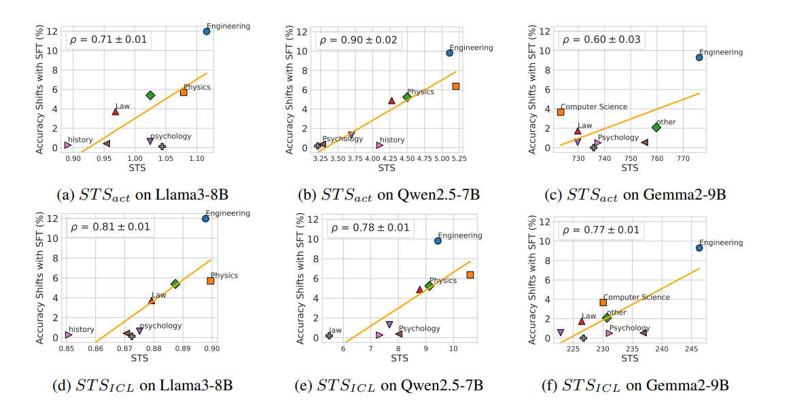

# STS (SAE-based Transferability Score)

This repository includes a PyTorch implementation of the ICLR 2026 paper [SAE as a Crystal Ball: Interpretable Features Predict Cross-domain Transferability of LLMs without Training](https://openreview.net/forum?id=KQYnfeBNjl) authored by Qi Zhang*, [Yifei Wang*](https://yifeiwang77.github.io/), Xiaohan Wang, Jiajun Chai, Guojun Yin, Wei Lin, and [Yisen Wang](https://yisenwang.github.io/).


STS is a metric that can predict the transferability of LLMs before training. STS identifies shifted dimensions in SAE representations and calculates their correlations with downstream domains. Extensive experiments across multiple models and domains show that STS accurately predicts the transferability of supervised fine-tuning, achieving Pearson correlation coefficients above 0.7 with actual performance changes.





## Instructions

### Environment Setup

To install the environment for STS with the following commands
```
pip install -r requirements.txt
```


### Extracting SAE Features


The core operation of STS is to extract sparse features from an LLM using a trained Sparse Autoencoder (SAE). Below, we provide an example of extracting SAE features on LIMO, demonstrating how to load the SAE, hook intermediate activations, and obtain sparse feature representations for downstream usage.

To extract SAE features with the following commands
```
cd extract_features
VLLM_USE_V1=1 python evaluate2.py 
```

### Evaluation of Downstream Performance

We use the official evaluation implementation provided by https://github.com/TIGER-AI-Lab/MMLU-Pro.


### Calculating STS Metrics

After obtaining SAE features, open sts.ipynb to calculate STS and correlation coefficient.


## Citing this work
If you find the work useful, please cite the accompanying paper:
```

```


